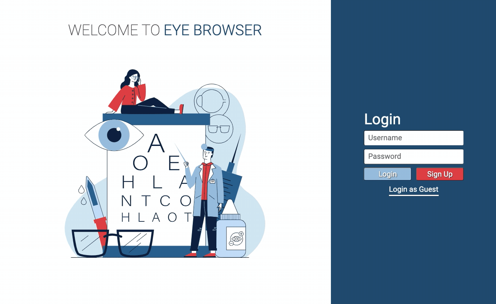
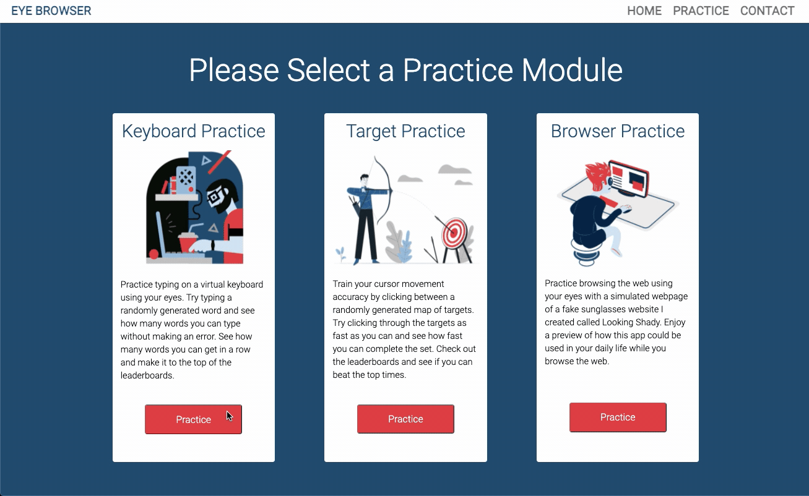

<!-- TABLE OF CONTENTS -->
<details open="open">
  <summary>Table of Contents</summary>
  <ol>
    <li>
      <a href="#about-the-project">About The Project</a>
      <ul>
       <li><a href="#demo">Demo</a></li>
       <li><a href="#built-with">Built With</a></li>   
      </ul>
    </li>
    <li>
      <a href="#getting-started">Getting Started</a>
      <ul>
        <li><a href="#prerequisites">Prerequisites</a></li>
        <li><a href="#installation-and-starting-the-project">Installation</a></li>
      </ul>
    </li>
    <li><a href="#contact">Contact</a></li>
  </ol>
</details>

<!-- ABOUT THE PROJECT -->
## About The Project

For this project, I built out a training application for an app I plan to create in the future called Lazy Eye. The goal of Lazy Eye is to improve accessibility by allowing users to browse the web with their eyes with the help of their webcams and an eye tracking library called WebGazer. 

As a first step toward that goal, I created this app, Lazy Eye Trainer, with a series of training modules that allow the user to become accustomed to using eye tracking for cursor movement in a variety of ways. This includes a keyboard module to practice typing on a virtual keyboard with your eyes,  a target module to practice precise cursor movement,  and also a browser module that simulates a webpage and prompts the user to perform actions. Currently, I am still working on implementing the eye tracking and look forward to overcoming the barriers I will come across with the limits in accuracy of the technology.

These modules were built with a combination of React and Bootstrap and an ArangoDB database was also used to store user logins and performance. Leaderboards were implemented across the modules to encourage continued practice and reward returning users.

Project Link: [https://github.com/ecetino/eye-browser](https://github.com/ecetino/eye-browser)

<!-- DEMO -->
### Demo
Login and Tabs Demo



Keyboard Module Demo



Target Module Demo


Browser Module Demo


<!-- Built With -->
### Built With

* [React](https://reactjs.org)
* [Express](http://expressjs.com/)
* [Axios](https://www.npmjs.com/package/axios)
* [Bootstrap](https://getbootstrap.com/)
* [ArangoDB](https://www.arangodb.com/)
* [WebGazer.js](https://webgazer.cs.brown.edu/)


<!-- GETTING STARTED -->
## Getting Started

To get a local copy up and running locally please follow these simple steps.

<!-- PREREQUISITES -->
### Prerequisites

* npm
  ```sh
  npm install npm@latest -g
  ```
* ArangoDB <br/>
  [macOS Installation](https://www.arangodb.com/docs/stable/installation-mac-osx.html)
  <br/>
  [Windows Installation](https://www.arangodb.com/docs/stable/installation-windows.html)  
  
<!-- INSTALLATION -->
### Installation and starting the project

1. Clone the repo and then cd into the repo
   ```sh
   git clone https://github.com/ecetino/eye-browser.git
   ```
2. Install NPM packages
   ```sh
   npm install
   ```
3. Seed ArangoDB database
   ```sh
   npm run seed
   ```
4. Build with Webpack
   ```sh
   npm run build
   ```
5. Run with NPM
   ```sh
   npm start
   ```
6. Go to localhost:3000 on your browser to view the training app

<!-- CONTACT -->
## Contact

<!-- LinkedIn Contact -->
<a href="https://www.linkedin.com/in/ecetino/" target="_blank">
  
</a>
  
<!--   Email -->
<a href="mailto:cetino-e@hotmail.com">
  
</a>
